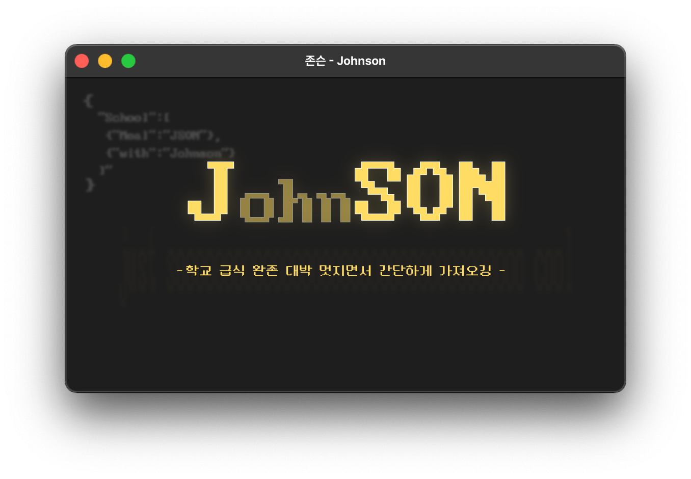

<p align=center></p>

## <big><p align=center><b>Johnson<b></p></big>

<p align=center><b>울 학교 급식 JSON<s>(존슨)</s> 분석하구 이쁘게 보여주기</b></p>


<br>

---
## <b>사용방법</b>
<br>

```now``` 함수를 사용하여 급식 식단을 불러올 수 있습니다. 불러온 식단은 ```list``` 형식으로 반환됩니다.<br>
```now``` 함수는 ```(학교타입, 학교코드, 추가_날짜, 알레르기_정보_표시, 자동_가져오기, 급식_시간대)```의 정보를 매개변수로 받습니다.

<br>

### <b>매개변수</b>

|매개변수|설명|선택사항|
|:----:|-----|:-----|
|학교타입|학교의 타입을 지정합니다.|필요|
|학교코드|학교의 고유코드를 지정합니다.|필요|
|날짜|[년, 월, 일]의 급식 정보를 반환합니다.|기본값 -> ```[현재 년도, 현재 월, 현재 일]```|
|알레르기_정보_표시|알레르기 정보 표시 여부를 지정합니다.|기본값 -> ```False```|
|자동_가져오기|현재 시간대에 맞는 급식 정보 반환여부를 지정합니다.|기본값 -> ```True```|
|급식_시간대|가져올 급식 식단의 시간대를 지정합니다.|'자동_가져오기'가 ```True```라면 필요하지 않습니다.|

#### <b>매개변수에 따른 값 타입</b>
|매개변수|타입|값|
|:----:|-----|:-----|
|학교타입|```str```|초등 : ```elementary```, 중등 : ```middle```, 고등 : ```high```|
|학교코드|```str```|<a href = 'https://schoolmenukr.ml/code/app'>이 곳에서 검색하여 나온 코드</a>|
|알레르기_정보_표시|```bool```|표시 : ```True```, 숨기기 : ```False```|
|자동_가져오기|```bool```|활성화 : ```True```, 비활성화 : ```False```|
|날짜|```list```|년/월/일 : ```[년, 월, 일]```|
|급식_시간대|```str```|조식 : ```breakfast```, 중식 : ```lunch```, 석식 : ```dinner```|

<br>

### <b>예제 코드</b>

```py

import johnson as meal
result = meal.now('high', 'N100000164') # 아산스마트팩토리마이스터고의 급식 식단을 반환

print(result)

```

#### <b>출력</b>
```py
['lunch', '친환경찹쌀흑미밥', '친환경돈육호박고추장찌개', '무항생제오향장육', '친환경콩나물무침(자율)', '친환경상추쌈+쌈장', '보쌈김치', '우유', '오렌지']
```

<br><br>

---
## <b>Pull Request</b>
<br>

> PR은 정말 언제나 환영입니다!!!<br>
저의 'Johnson' 리포지토리에 많은 기여를 해주세요!


---


## <b>사용된 API</b>
<br>

> <a href = 'https://github.com/5d-jh/school-menu-api'>**[학교식단 API]**</a>

---

## <b>라이선스</b>
<br>

> 현재 리포지토리는 MIT 라이선스 하에 배포됩니다.<br>
누구나 소스코드를 수정하거나 복제하는 등의 모든 행위가 허용됩니다.<br>
<br><s>근데 이런 오픈소스 사용했다는거 남겨주면 정말 좋아죽음</s>
